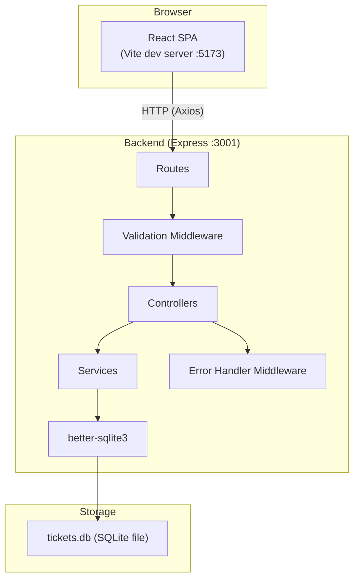
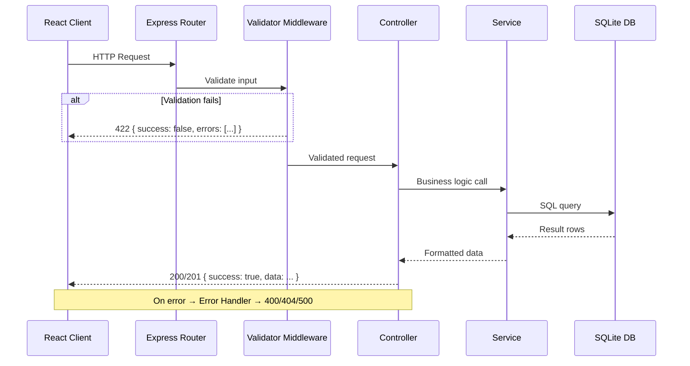
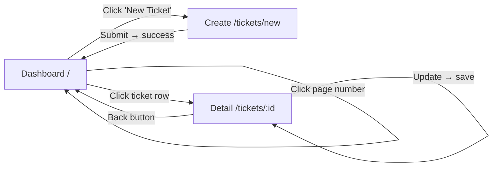

# Support Ticket Dashboard — Architecture & Design

---

## 1. Requirement-to-Criteria Mapping

| # | Requirement | How We Satisfy It | Primary Criterion (Weight) |
|---|---|---|---|
| 1a | Title: required, max 120 chars | Frontend: controlled input with char counter + disabled submit. Backend: express-validator `notEmpty().isLength({max:120})`. Return 422. | API validation (20%) |
| 1b | Description: required | Frontend: `<textarea>` required check. Backend: `notEmpty()`. | API validation (20%) |
| 1c | Customer email: required, valid | Frontend: `type="email"` + regex. Backend: `isEmail()`. | API validation (20%) |
| 1d | Priority enum (Low/Med/High) | Frontend: `<select>`. Backend: `isIn(['Low','Medium','High'])`. DB: CHECK constraint. | Functional correctness (30%) |
| 1e | Status enum, default Open | Frontend: default value. Backend: default in schema + `isIn()`. DB: DEFAULT 'Open'. | Functional correctness (30%) |
| 1f | Timestamps auto-generated | DB columns `created_at DEFAULT CURRENT_TIMESTAMP`, `updated_at` via trigger or app-level. | Functional correctness (30%) |
| 1g | Useful error messages | Structured error response `{ errors: [{ field, message }] }`. Display inline per-field on frontend. | API design (20%) + Usability (15%) |
| 2a | Search by title or email | Backend: `WHERE title LIKE ? OR customer_email LIKE ?` (case-insensitive via `COLLATE NOCASE`). Frontend: debounced search input. | Functional correctness (30%) |
| 2b | Filter by status and priority | Backend: optional `WHERE` clauses appended. Frontend: dropdown selects. | Functional correctness (30%) |
| 2c | Sort by created_at asc/desc | Backend: `ORDER BY created_at ?`. Frontend: toggle button. | Functional correctness (30%) |
| 2d | Pagination, 10/page | Backend: `LIMIT 10 OFFSET ?`, return `{ data, pagination: { page, pageSize, totalPages, totalCount } }`. Frontend: page nav buttons. | Functional correctness (30%) |
| 2e | Filters + search combine | Backend builds query dynamically. | Functional correctness (30%) |
| 3a | View ticket detail | `GET /api/tickets/:id`. Detail page/modal with all fields. | Functional correctness (30%) |
| 3b | Update status & priority | `PATCH /api/tickets/:id` with `{ status, priority }`. `updated_at` refreshed. | Functional correctness (30%) |
| 3c | Persist after refresh | SQLite on disk. Re-fetch on mount. | Functional correctness (30%) |
| 4a | Summary counts (total + by status) | `GET /api/tickets/stats` → `{ total, open, inProgress, resolved }`. Always reflects full dataset. | Functional correctness (30%) |
| 5a | Responsive desktop + mobile | CSS media queries, flexbox/grid, mobile-first. | Usability (15%) |
| 5b | Loading/empty/error states | Spinner component, "No tickets found" illustration, error banner with retry. | Usability (15%) |
| 5c | Meaningful HTTP codes | 200, 201, 400, 404, 422, 500 used correctly. | API design (20%) |
| 5d | Consistent error response | `{ success: false, errors: [...] }` everywhere. Global error handler middleware. | API design (20%) |
| 5e | Code organization | Layered folders: routes → controllers → services → models. | Code structure (25%) |
| 5f | 3+ automated tests | 7 tests with Jest + Supertest. | Tests & docs (10%) |
| 5g | 25+ seed tickets | Seed script with varied data. | Tests & docs (10%) |
| 5h | README + setup docs | Complete README with all sections. | Tests & docs (10%) |

### Effort Investment Strategy

| Criterion | Weight | Time Budget (of 6h) | Key Actions |
|---|---|---|---|
| Functional correctness & persistence | 30% | ~2.5h | All CRUD, search/filter/sort/pagination, stats, SQLite |
| Code structure & maintainability | 25% | ~1h | Layered architecture, clean separation, consistent naming |
| API design, validation, error handling | 20% | ~1h | Dual validation, error middleware, proper HTTP codes |
| Usability & responsive behavior | 15% | ~1h | Responsive CSS, states (loading/empty/error), intuitive UX |
| Tests & documentation | 10% | ~0.5h | 7 tests + README |

---

## 2. Tech Stack

| Layer | Choice | Reason |
|---|---|---|
| **Frontend framework** | React 18 (via Vite) | Most popular, reviewer-friendly, fast dev with Vite's zero-config |
| **Frontend HTTP client** | Axios | Cleaner API than fetch, interceptors for error handling |
| **Frontend routing** | React Router v6 | Standard for React SPAs, simple API |
| **Backend framework** | Express.js | Industry standard for Node.js, minimal boilerplate |
| **Validation** | express-validator (backend) | Declarative, chains with Express middleware |
| **Database** | SQLite via better-sqlite3 | Zero-config, file-based, no install needed, synchronous API is simpler |
| **Testing** | Jest + Supertest | Jest is standard for JS; Supertest for HTTP-level API tests |
| **Seed data** | Custom JS script | Simple, no extra dependency |
| **Dev tooling** | concurrently | Run frontend + backend with one `npm run dev` command |
| **Environment config** | dotenv | Standard .env file loading |

> **Why better-sqlite3 over knex/sequelize?** For a small app with one table, a thin wrapper is simpler, faster, and easier to explain in an interview. We'll write a small `db.js` module that exposes prepared statements.

---

## 3. System Architecture

### Architecture Diagram



### Request Flow



### Folder Structure

```
support-ticket-dashboard/
├── client/                          # React frontend
│   ├── public/
│   │   └── index.html
│   ├── src/
│   │   ├── api/
│   │   │   └── ticketApi.js         # Axios instance + API call functions
│   │   ├── components/
│   │   │   ├── common/
│   │   │   │   ├── ErrorBanner.jsx      # Reusable error display
│   │   │   │   ├── LoadingSpinner.jsx   # Reusable loading indicator
│   │   │   │   ├── EmptyState.jsx       # "No results" display
│   │   │   │   └── Pagination.jsx       # Page navigation controls
│   │   │   ├── tickets/
│   │   │   │   ├── TicketForm.jsx       # Create ticket form
│   │   │   │   ├── TicketCard.jsx       # Single ticket in list
│   │   │   │   ├── TicketList.jsx       # List of TicketCards
│   │   │   │   ├── TicketDetail.jsx     # Full ticket view + edit
│   │   │   │   ├── TicketFilters.jsx    # Search + filter + sort controls
│   │   │   │   └── StatusBadge.jsx      # Color-coded status pill
│   │   │   └── dashboard/
│   │   │       └── StatsSummary.jsx     # Total + status counts
│   │   ├── hooks/
│   │   │   └── useTickets.js        # Custom hook: fetch, filter state, pagination
│   │   ├── pages/
│   │   │   ├── DashboardPage.jsx    # Main listing page (stats + filters + list)
│   │   │   ├── CreateTicketPage.jsx # Ticket creation form page
│   │   │   └── TicketDetailPage.jsx # Single ticket view/edit page
│   │   ├── utils/
│   │   │   └── validation.js        # Shared validation helpers
│   │   ├── App.jsx                  # Router setup
│   │   ├── App.css                  # Global styles + design system variables
│   │   └── main.jsx                 # Entry point
│   ├── package.json
│   └── vite.config.js               # Proxy /api → backend
├── server/                          # Express backend
│   ├── src/
│   │   ├── config/
│   │   │   └── database.js          # SQLite connection + init schema
│   │   ├── controllers/
│   │   │   └── ticketController.js  # Request/response handling
│   │   ├── middleware/
│   │   │   ├── errorHandler.js      # Global error handler
│   │   │   └── validators.js        # express-validator chains
│   │   ├── routes/
│   │   │   └── ticketRoutes.js      # Route definitions
│   │   ├── services/
│   │   │   └── ticketService.js     # Business logic + SQL queries
│   │   ├── constants.js             # Shared enums (STATUSES, PRIORITIES, etc.)
│   │   └── app.js                   # Express app setup (middleware, routes)
│   ├── seed/
│   │   └── seedData.js              # 25+ ticket seed data + runner
│   ├── tests/
│   │   ├── tickets.validation.test.js
│   │   ├── tickets.query.test.js
│   │   └── tickets.update.test.js
│   ├── package.json
│   └── server.js                    # Entry point (listen)
├── .env.example
├── .gitignore
├── package.json                     # Root: concurrently scripts
└── README.md
```

---

## 4. Database Schema

### `tickets` Table

| Column | Type | Constraints |
|---|---|---|
| `id` | INTEGER | PRIMARY KEY AUTOINCREMENT |
| `title` | TEXT | NOT NULL, CHECK(length(title) <= 120) |
| `description` | TEXT | NOT NULL |
| `customer_email` | TEXT | NOT NULL |
| `priority` | TEXT | NOT NULL, CHECK(priority IN ('Low', 'Medium', 'High')), DEFAULT 'Medium' |
| `status` | TEXT | NOT NULL, CHECK(status IN ('Open', 'In Progress', 'Resolved')), DEFAULT 'Open' |
| `created_at` | TEXT | NOT NULL, DEFAULT (datetime('now')) |
| `updated_at` | TEXT | NOT NULL, DEFAULT (datetime('now')) |

### Indexes

```sql
CREATE INDEX idx_tickets_status ON tickets(status);
CREATE INDEX idx_tickets_priority ON tickets(priority);
CREATE INDEX idx_tickets_created_at ON tickets(created_at);
CREATE INDEX idx_tickets_title ON tickets(title COLLATE NOCASE);
CREATE INDEX idx_tickets_email ON tickets(customer_email COLLATE NOCASE);
```

### Schema SQL

```sql
CREATE TABLE IF NOT EXISTS tickets (
  id             INTEGER PRIMARY KEY AUTOINCREMENT,
  title          TEXT    NOT NULL CHECK(length(title) <= 120),
  description    TEXT    NOT NULL,
  customer_email TEXT    NOT NULL,
  priority       TEXT    NOT NULL DEFAULT 'Medium'
                         CHECK(priority IN ('Low', 'Medium', 'High')),
  status         TEXT    NOT NULL DEFAULT 'Open'
                         CHECK(status IN ('Open', 'In Progress', 'Resolved')),
  created_at     TEXT    NOT NULL DEFAULT (datetime('now')),
  updated_at     TEXT    NOT NULL DEFAULT (datetime('now'))
);
```

### Seed Data Plan

Generate **25 tickets** with the following distribution:

| Status | Count | Priorities |
|---|---|---|
| Open | 10 | 3 High, 4 Medium, 3 Low |
| In Progress | 8 | 3 High, 3 Medium, 2 Low |
| Resolved | 7 | 2 High, 3 Medium, 2 Low |

- **Titles**: Realistic support topics: "Login page not loading after update", "Cannot export CSV report", "Billing shows incorrect amount", "Password reset email not received", "Mobile app crashes on launch", etc.
- **Emails**: Varied domains: `alice@example.com`, `bob.smith@company.org`, `jane@startup.io`, etc.
- **Dates**: Spread `created_at` over the past 30 days (subtract random days/hours from now). Set `updated_at` = `created_at` for Open tickets; later for others.
- **Descriptions**: 1-3 sentence realistic descriptions of each issue.

---

## 5. API Design

### Base URL: `/api`

### Endpoints

| Method | Endpoint | Purpose | Success Code |
|---|---|---|---|
| `GET` | `/api/tickets` | List tickets (search, filter, sort, paginate) | 200 |
| `GET` | `/api/tickets/stats` | Summary counts | 200 |
| `GET` | `/api/tickets/:id` | Get single ticket | 200 |
| `POST` | `/api/tickets` | Create ticket | 201 |
| `PATCH` | `/api/tickets/:id` | Update ticket details | 200 |
| `DELETE` | `/api/tickets/:id` | Delete ticket | 200 |

> **Important**: Define the `/api/tickets/stats` route BEFORE `/api/tickets/:id` in the router so `stats` isn't interpreted as an `:id` parameter.

### `GET /api/tickets` — Query Parameters

| Param | Type | Default | Notes |
|---|---|---|---|
| `search` | string | `""` | Partial, case-insensitive match on `title` OR `customer_email` |
| `status` | string | `""` | Exact match: `Open`, `In Progress`, `Resolved`. Empty = all |
| `priority` | string | `""` | Exact match: `Low`, `Medium`, `High`. Empty = all |
| `sortBy` | string | `"created_at"` | Only `created_at` supported |
| `sortOrder` | string | `"desc"` | `asc` or `desc` |
| `page` | integer | `1` | Min 1. Out-of-range returns empty data array (not error) |
| `pageSize` | integer | `10` | Fixed at 10 (ignored if sent differently — or allow override) |

### Response: `GET /api/tickets`

```json
{
  "success": true,
  "data": [
    {
      "id": 1,
      "title": "Login page not loading",
      "description": "Users report a blank white screen...",
      "customer_email": "alice@example.com",
      "priority": "High",
      "status": "Open",
      "created_at": "2026-09-25T10:30:00.000Z",
      "updated_at": "2026-09-25T10:30:00.000Z"
    }
  ],
  "pagination": {
    "page": 1,
    "pageSize": 10,
    "totalCount": 25,
    "totalPages": 3
  }
}
```

### Response: `GET /api/tickets/stats`

```json
{
  "success": true,
  "data": {
    "total": 25,
    "open": 10,
    "inProgress": 8,
    "resolved": 7
  }
}
```

### Response: `GET /api/tickets/:id`

```json
{
  "success": true,
  "data": {
    "id": 1,
    "title": "Login page not loading",
    "description": "Users report a blank white screen when...",
    "customer_email": "alice@example.com",
    "priority": "High",
    "status": "Open",
    "created_at": "2026-09-25T10:30:00.000Z",
    "updated_at": "2026-09-25T10:30:00.000Z"
  }
}
```

### Request/Response: `POST /api/tickets`

**Request body:**
```json
{
  "title": "New issue title",
  "description": "Detailed description of the problem",
  "customer_email": "user@example.com",
  "priority": "High"
}
```

**Response (201):**
```json
{
  "success": true,
  "data": { "id": 26, "title": "...", "status": "Open", "...": "..." }
}
```

### Request/Response: `PATCH /api/tickets/:id`

**Request body (partial — only fields being updated):**
```json
{
  "status": "In Progress",
  "priority": "Medium"
}
```

**Response (200):**
```json
{
  "success": true,
  "data": { "id": 1, "...": "...", "updated_at": "2026-09-28T..." }
}
```

### Consistent Error Response Format

All errors follow this shape:

```json
{
  "success": false,
  "error": {
    "code": 422,
    "message": "Validation failed",
    "details": [
      { "field": "title", "message": "Title is required" },
      { "field": "customer_email", "message": "Must be a valid email address" }
    ]
  }
}
```

### Error Code Usage

| Scenario | HTTP Code | `error.message` |
|---|---|---|
| Missing/invalid fields on create | 422 | "Validation failed" |
| Invalid status/priority on update | 422 | "Validation failed" |
| Invalid query params (bad page number) | 400 | "Invalid request parameters" |
| Ticket ID not found | 404 | "Ticket not found" |
| Unexpected server error | 500 | "Internal server error" |

---

## 6. Validation Rules

### Shared Constants (used by both frontend and backend)

```
PRIORITIES = ['Low', 'Medium', 'High']
STATUSES   = ['Open', 'In Progress', 'Resolved']
TITLE_MAX  = 120
EMAIL_REGEX = /^[^\s@]+@[^\s@]+\.[^\s@]+$/
```

> These constants live in `client/src/utils/validation.js` and are duplicated in a `server/src/constants.js` file. We duplicate rather than share a monorepo package to keep setup simple.

### Create Ticket Validation

| Field | Frontend Check | Backend Check (express-validator) |
|---|---|---|
| `title` | Required, max 120 chars, trim whitespace | `body('title').trim().notEmpty().isLength({max: 120})` |
| `description` | Required, not blank after trim | `body('description').trim().notEmpty()` |
| `customer_email` | Required, regex match | `body('customer_email').trim().notEmpty().isEmail().normalizeEmail()` |
| `priority` | Dropdown limits choices | `body('priority').optional().isIn(PRIORITIES)` (defaults to Medium) |

### Update Ticket Validation

| Field | Frontend Check | Backend Check |
|---|---|---|
| `status` | Dropdown limits choices | `body('status').optional().isIn(STATUSES)` |
| `priority` | Dropdown limits choices | `body('priority').optional().isIn(PRIORITIES)` |
| At least one field | Disable save if nothing changed | Custom middleware: if body is empty → 400 |

### Query Parameter Validation

| Param | Backend Check |
|---|---|
| `page` | `query('page').optional().isInt({min: 1}).toInt()` |
| `pageSize` | `query('pageSize').optional().isInt({min: 1, max: 100}).toInt()` |
| `sortOrder` | `query('sortOrder').optional().isIn(['asc','desc'])` |
| `status` | `query('status').optional().isIn(['', ...STATUSES])` |
| `priority` | `query('priority').optional().isIn(['', ...PRIORITIES])` |
| `search` | Sanitize: `query('search').optional().trim()` |

---

## 7. UI/UX Design

### Pages

| Page | Route | Purpose |
|---|---|---|
| Dashboard | `/` | Stats bar + filters + ticket list + pagination |
| Create Ticket | `/tickets/new` | Form to submit a new ticket |
| Ticket Detail | `/tickets/:id` | View full ticket + update status/priority |

### User Flows



### Component List

| Component | Props / Responsibility |
|---|---|
| `StatsSummary` | Fetches and displays `{ total, open, inProgress, resolved }` as 4 count cards |
| `TicketFilters` | Search input (debounced 300ms), status dropdown, priority dropdown, sort toggle. Calls parent's `onFilterChange`. |
| `TicketList` | Receives array of tickets, renders `TicketCard` for each |
| `TicketCard` | Displays title, email, priority badge, status badge, created date. Clickable → navigates to detail. |
| `TicketForm` | Controlled form for creating a ticket. Shows inline field errors. |
| `TicketDetail` | Displays full ticket. Status and priority are editable dropdowns with a "Save" button. |
| `StatusBadge` | Colored pill: Open=blue, In Progress=amber, Resolved=green |
| `Pagination` | Previous/Next + page numbers. Disables at boundaries. Shows "Page X of Y". |
| `LoadingSpinner` | Centered spinner animation |
| `EmptyState` | Icon + message ("No tickets found. Try adjusting your filters.") |
| `ErrorBanner` | Red banner with error message + "Retry" button |

### Design System (Simple & Clean)

```css
/* CSS Custom Properties — defined in App.css */
:root {
  /* Colors */
  --color-primary: #2563eb;       /* Blue-600 */
  --color-primary-hover: #1d4ed8; /* Blue-700 */
  --color-success: #16a34a;       /* Green-600 */
  --color-warning: #d97706;       /* Amber-600 */
  --color-danger: #dc2626;        /* Red-600 */
  --color-bg: #f8fafc;            /* Slate-50 */
  --color-surface: #ffffff;
  --color-border: #e2e8f0;        /* Slate-200 */
  --color-text: #1e293b;          /* Slate-800 */
  --color-text-muted: #64748b;    /* Slate-500 */

  /* Typography */
  --font-family: 'Inter', -apple-system, BlinkMacSystemFont, sans-serif;
  --font-size-sm: 0.875rem;
  --font-size-base: 1rem;
  --font-size-lg: 1.25rem;
  --font-size-xl: 1.5rem;

  /* Spacing */
  --space-xs: 0.25rem;
  --space-sm: 0.5rem;
  --space-md: 1rem;
  --space-lg: 1.5rem;
  --space-xl: 2rem;

  /* Other */
  --radius: 0.5rem;
  --shadow: 0 1px 3px rgba(0,0,0,0.1);
  --max-width: 960px;
}
```

- **Font**: Import Inter from Google Fonts (via `<link>` in `index.html`)
- **Layout**: Single column, max-width 960px, centered. Cards use `border: 1px solid var(--color-border)` and `border-radius: var(--radius)`.
- **Buttons**: Solid primary button for actions, outlined for secondary. All with `cursor: pointer`, `border-radius: var(--radius)`.

### Responsive Rules

| Breakpoint | Behavior |
|---|---|
| Desktop (≥768px) | Stats cards in a row of 4. Filters in a row. Ticket cards show all columns. |
| Mobile (<768px) | Stats cards stack 2×2. Filters stack vertically. Ticket cards simplify (title + status only). Full-width buttons. |

### Accessibility Basics

- All form inputs have `<label>` elements.
- Buttons have descriptive text (not just icons).
- Color is not the only indicator (badges have text + color).
- Focus styles visible on all interactive elements.
- `aria-label` on icon-only buttons if any.
- Semantic HTML: `<main>`, `<nav>`, `<header>`, `<form>`, `<table>` or `<ul>`.

### States by Screen

| Page | Loading State | Empty State | Error State |
|---|---|---|---|
| Dashboard (list) | Spinner in list area, stats show skeleton | "No tickets found. Try adjusting your filters." with illustration | Red banner above list: "Failed to load tickets." + Retry |
| Dashboard (stats) | Skeleton placeholders (gray boxes) for 4 stat cards | N/A (always shows counts, even 0) | Stats section shows "—" with error tooltip |
| Create Ticket | Submit button shows spinner, disabled | N/A | Inline field errors below each input; toast/banner for server errors |
| Ticket Detail | Full-page spinner while fetching | N/A | "Ticket not found" message for 404; error banner for 500 |
| Ticket Detail (save) | Save button shows spinner, disabled | N/A | Error banner: "Failed to update ticket." + Retry |

---

## 8. Testing Plan

**Framework**: Jest + Supertest (HTTP-level API tests)

**Setup**: Each test file imports the Express `app` (not the server listener). Use a fresh in-memory SQLite database per test suite (`:memory:`) to avoid file conflicts.

| # | Test File | Test Name | What It Checks | Criterion |
|---|---|---|---|---|
| 1 | `tickets.validation.test.js` | `POST /api/tickets — rejects missing title` | Send `{ description, customer_email, priority }` without `title`. Expect 422 with `errors` array containing `{ field: "title" }`. | API validation (20%) |
| 2 | `tickets.validation.test.js` | `POST /api/tickets — rejects invalid email` | Send `{ title, description, customer_email: "not-an-email" }`. Expect 422 with error on `customer_email`. | API validation (20%) |
| 3 | `tickets.validation.test.js` | `POST /api/tickets — rejects title over 120 chars` | Send title with 121 characters. Expect 422. | API validation (20%) |
| 4 | `tickets.query.test.js` | `GET /api/tickets — filters by status and searches by title` | Seed 5 tickets (mixed statuses/titles). Request `?status=Open&search=login`. Verify only matching tickets returned, pagination metadata correct. | Functional correctness (30%) |
| 5 | `tickets.query.test.js` | `GET /api/tickets — paginates and sorts correctly` | Seed 15 tickets. Request `?page=2&sortOrder=asc`. Verify 5 tickets returned (page 2 of 2), sorted ascending, `totalPages=2`. | Functional correctness (30%) |
| 6 | `tickets.update.test.js` | `PATCH /api/tickets/:id — updates status and priority` | Create a ticket, PATCH `{ status: "Resolved", priority: "Low" }`. GET the ticket again. Verify fields changed and `updated_at` > `created_at`. | Functional correctness (30%) |
| 7 | `tickets.update.test.js` | `PATCH /api/tickets/:id — returns 404 for non-existent ticket` | PATCH `/api/tickets/9999`. Expect 404 with proper error shape. | API design (20%) |

> 7 tests total (exceeds the minimum of 3). Tests 4 and 5 are the most complex and valuable.

---

## 9. Core vs. Bonus Features

### CORE (Must complete — mapped to scoring criteria)

- [ ] Full CRUD: create ticket, list with search/filter/sort/pagination, view detail, update status/priority
- [ ] Backend validation with express-validator + frontend validation
- [ ] Consistent error responses (422, 404, 400, 500)
- [ ] Summary stats endpoint + display
- [ ] Responsive layout (desktop + mobile)
- [ ] Loading, empty, and error states on every screen
- [ ] 25+ seed tickets
- [ ] 7 automated tests
- [ ] Complete README

### BONUS (Safe, small, impressive additions — only after CORE is done)

| Bonus | Time | Why It Impresses | Risk |
|---|---|---|---|
| Toast notifications on create/update success | 15 min | Polished UX, shows attention to feedback | Very low |
| Debounced search (300ms) | 10 min | Shows performance awareness | Very low |
| URL-synced filters (query params in browser URL) | 20 min | Shareable URLs, back-button works, shows depth | Low |
| Subtle CSS transitions on cards (hover shadow) | 10 min | Feels polished | Very low |
| Priority badge colors (High=red, Medium=amber, Low=green) | 5 min | Visual clarity | Very low |
| Keyboard shortcut: Escape to close detail / go back | 10 min | Accessibility bonus | Very low |

---

## 10. Interview-Readiness: Likely Change Requests

| # | Likely Change Request | Files to Touch | Complexity |
|---|---|---|---|
| 1 | **Add a new field** (e.g., `category`) | `database.js` (add column), `ticketService.js` (include in queries), `validators.js` (add rule), `TicketForm.jsx` (add dropdown), `TicketDetail.jsx` (display), `validation.js` (add constant), `seedData.js` (add values) | Medium |
| 2 | **Add a new status** (e.g., `"Closed"`) | `constants.js` (add to STATUSES array), `validation.js` (frontend mirror), `database.js` (update CHECK), `StatusBadge.jsx` (add color), `StatsSummary.jsx` (add count card) | Low |
| 3 | **Add a new filter** (e.g., date range) | `TicketFilters.jsx` (add date inputs), `useTickets.js` (add params), `ticketApi.js` (pass params), `validators.js` (validate), `ticketService.js` (add WHERE clause) | Medium |
| 4 | **Change page size** (e.g., 20 instead of 10) | `ticketApi.js` (change default `pageSize`), or make it a constant in one place. Backend already supports `pageSize` param. | Very low |
| 5 | **Add a sort option** (e.g., sort by priority) | `TicketFilters.jsx` (add sort option), `ticketService.js` (add `ORDER BY` case), `validators.js` (allow new `sortBy` value) | Low |
| 6 | **Add a "Delete ticket" feature** | `ticketRoutes.js` (new DELETE route), `ticketController.js` (new method), `ticketService.js` (DELETE query), `TicketDetail.jsx` (delete button + confirm dialog), `ticketApi.js` (new API call) | Medium |
| 7 | **Make description optional** | `validators.js` (change `notEmpty()` to `optional()`), `TicketForm.jsx` (remove `required`), `database.js` (remove NOT NULL) | Very low |
| 8 | **Add an "Assigned to" field** | Same pattern as #1: DB column, service queries, validator, form field, detail display, seed data | Medium |

> **Design principle**: All enums and constants are centralized. All SQL is in one service file. All validation is in one middleware file. This makes any change a predictable, small edit.

---

## Ambiguities & Assumptions

| # | Ambiguity | Assumption Made |
|---|---|---|
| 1 | Does search match partially? | Yes — `LIKE '%term%'` with case-insensitive collation |
| 2 | Does search match title OR email simultaneously? | Yes — OR condition in WHERE clause |
| 3 | What if page is out of range? | Return empty `data: []` with correct `totalPages`. No error. |
| 4 | Are summary counts filtered or global? | Global (assignment says "regardless of active filters") |
| 5 | Should stats refresh after create/update? | Yes — frontend re-fetches stats after any mutation |
| 6 | Can users update title/description/email? | Title and description can be updated, email cannot. |
| 7 | Is pageSize fixed at 10 or configurable? | Default 10 but backend accepts pageSize param for flexibility |
| 8 | What happens on concurrent edits? | Out of scope — no locking needed for a single-user app |
| 9 | Should the app use server-side rendering? | No — SPA is simpler and sufficient for this assignment |
| 10 | Should "In Progress" be one word or two in URLs? | Use the exact string "In Progress" in DB/API; URL-encode in query params |
