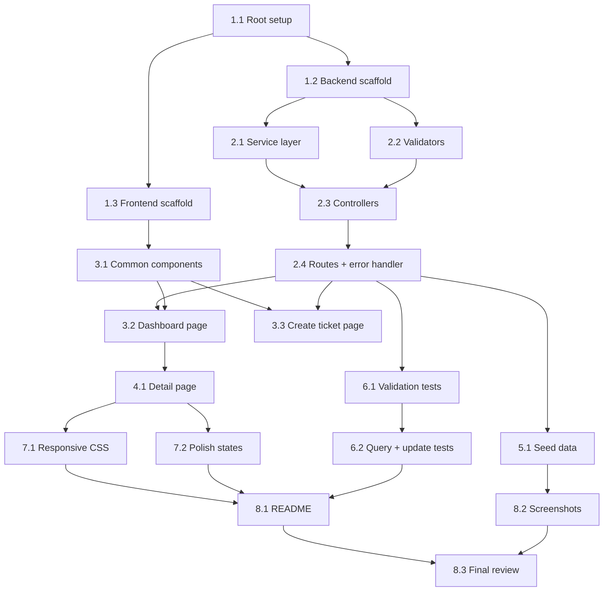

# Support Ticket Dashboard — Implementation Plan (TASKS.md)

> Total time spent: **[X] hours**
> Key milestone: **Working end-to-end by Phase 3** (~2 hours in)

---

## Phase 1: Project Scaffolding (30 min)

### Task 1.1 — Root project setup
- **Goal**: Create the monorepo root with `concurrently` to run client + server together
- **Files to create**:
  - `package.json` (root — scripts: `dev`, `install-all`, `seed`, `test`)
  - `.gitignore` (node_modules, *.db, .env, dist/)
  - `.env.example` (`PORT=3001`, `DB_PATH=./tickets.db`, `NODE_ENV=development`)
- **Acceptance criteria**: `npm run install-all` installs both client and server deps
- **Test**: Run `npm run install-all` — no errors

### Task 1.2 — Backend scaffolding
- **Goal**: Express app with health check, SQLite connection, schema initialization
- **Files to create**:
  - `server/package.json` (express, better-sqlite3, express-validator, cors, dotenv, helmet; devDeps: jest, supertest)
  - `server/server.js` — entry point, reads PORT from env, calls `app.listen()`
  - `server/src/app.js` — Express app: `cors()`, `express.json()`, `helmet()`, mounts routes, error handler
  - `server/src/config/database.js` — Opens SQLite file (or `:memory:` for tests via env), runs `CREATE TABLE IF NOT EXISTS`, creates indexes
  - `server/src/constants.js` — `STATUSES`, `PRIORITIES`, `TITLE_MAX_LENGTH`
- **Acceptance criteria**: `node server/server.js` starts, `GET /api/health` returns `{ status: "ok" }`
- **Test**: `curl http://localhost:3001/api/health`

### Task 1.3 — Frontend scaffolding
- **Goal**: Vite + React app with routing and proxy config
- **Files to create**:
  - Initialize with `npm create vite@latest client -- --template react` (or manually create files)
  - `client/vite.config.js` — add proxy: `/api` → `http://localhost:3001`
  - `client/src/App.jsx` — React Router with 3 routes (`/`, `/tickets/new`, `/tickets/:id`)
  - `client/src/main.jsx` — Standard entry
  - `client/src/App.css` — Design system CSS variables (from ARCHITECTURE.md §7)
  - `client/src/api/ticketApi.js` — Axios instance with `baseURL: '/api'`
  - Install: react-router-dom, axios
- **Acceptance criteria**: `npm run dev` in client shows React app, proxy works
- **Test**: Open browser, see placeholder pages; `/api/health` returns data through proxy

---

## Phase 2: Backend Core — CRUD + Validation (60 min)

### Task 2.1 — Ticket service layer (data access)
- **Goal**: All SQL operations in one file with prepared statements
- **Files to create**:
  - `server/src/services/ticketService.js` with methods:
    - `createTicket({ title, description, customer_email, priority })` → returns full ticket
    - `getTicketById(id)` → returns ticket or null
    - `updateTicket(id, { status, priority })` → updates, sets `updated_at`, returns updated ticket
    - `getTickets({ search, status, priority, sortOrder, page, pageSize })` → returns `{ tickets, totalCount }`
    - `getStats()` → returns `{ total, open, inProgress, resolved }`
- **Acceptance criteria**: Each method executes correct SQL, handles LIKE search, dynamic WHERE, pagination
- **Test**: Unit-test each method in isolation (or just via integration tests in Phase 6)

### Task 2.2 — Validation middleware
- **Goal**: express-validator chains for create, update, and query params
- **Files to create**:
  - `server/src/middleware/validators.js`
    - `validateCreateTicket` — chain for title, description, customer_email, priority
    - `validateUpdateTicket` — chain for status, priority (both optional, at least one required)
    - `validateQueryParams` — chain for search, status, priority, sortOrder, page, pageSize
    - `handleValidationErrors` — middleware that checks `validationResult(req)` and returns 422 if errors
- **Acceptance criteria**: Invalid inputs return 422 with `{ success: false, error: { details: [...] } }`
- **Test**: Will be covered by test suite in Phase 6

### Task 2.3 — Controller layer
- **Goal**: Request/response handling, calls service, formats responses
- **Files to create**:
  - `server/src/controllers/ticketController.js`
    - `createTicket(req, res, next)` — calls service, returns 201
    - `getTickets(req, res, next)` — extracts query params with defaults, calls service, returns 200 with pagination
    - `getTicketById(req, res, next)` — calls service, returns 200 or 404
    - `updateTicket(req, res, next)` — calls service, returns 200 or 404
    - `getStats(req, res, next)` — calls service, returns 200
- **Acceptance criteria**: All controllers catch errors and pass to `next()`

### Task 2.4 — Routes + error handler
- **Goal**: Wire routes with validators and controllers; global error handler
- **Files to create**:
  - `server/src/routes/ticketRoutes.js` — mount all 5 endpoints with validator middleware
  - `server/src/middleware/errorHandler.js` — catches all errors, returns consistent `{ success: false, error: {...} }` with 500 status
- **Acceptance criteria**: All 5 endpoints work via curl/Postman. Errors return consistent format.
- **Test**: Manual curl tests for each endpoint

---

## Phase 3: Frontend Core — List + Create (60 min)

> **Milestone**: After this phase, the app is fully functional end-to-end (create + list + navigate)

### Task 3.1 — Common UI components
- **Goal**: Build reusable components for loading, empty, error, pagination, and status badge
- **Files to create**:
  - `client/src/components/common/LoadingSpinner.jsx` + CSS
  - `client/src/components/common/EmptyState.jsx`
  - `client/src/components/common/ErrorBanner.jsx` (message + retry button)
  - `client/src/components/common/Pagination.jsx` (prev/next + page numbers + disabled states)
  - `client/src/components/tickets/StatusBadge.jsx` (colored pill per status)
- **Acceptance criteria**: Components render correctly with props, handle edge cases (page 1 disables prev, etc.)

### Task 3.2 — Dashboard page (list + stats + filters)
- **Goal**: Main page showing stats, filters, ticket list, and pagination
- **Files to create**:
  - `client/src/hooks/useTickets.js` — custom hook managing: filters state, page state, fetch tickets, fetch stats, loading/error state
  - `client/src/components/dashboard/StatsSummary.jsx` — 4 count cards
  - `client/src/components/tickets/TicketFilters.jsx` — search input + status dropdown + priority dropdown + sort toggle
  - `client/src/components/tickets/TicketList.jsx` — maps tickets to TicketCards
  - `client/src/components/tickets/TicketCard.jsx` — clickable card with title, email, status badge, priority, date
  - `client/src/pages/DashboardPage.jsx` — assembles all above components
- **Acceptance criteria**: 
  - Page loads and shows 25 seeded tickets (paginated)
  - Search works (debounced 300ms)
  - Status and priority filters work
  - Sort toggles between newest/oldest
  - Pagination navigates correctly
  - Loading spinner shown during fetch
  - Empty state shown when no results
  - Error banner shown on API failure

### Task 3.3 — Create ticket page
- **Goal**: Form to create a new ticket with frontend validation
- **Files to create**:
  - `client/src/utils/validation.js` — `validateTitle()`, `validateEmail()`, `validateDescription()` + constants
  - `client/src/components/tickets/TicketForm.jsx` — controlled form with inline errors, char counter, submit handler
  - `client/src/pages/CreateTicketPage.jsx` — wrapper page
- **Acceptance criteria**:
  - Form validates on submit (and optionally on blur)
  - Shows inline errors per field
  - Disables submit while sending
  - On success, navigates to dashboard
  - On server error, shows error banner
- **Test**: Create a ticket manually, verify it appears in the list

---

## Phase 4: Frontend — Ticket Detail + Update (30 min)

### Task 4.1 — Ticket detail page
- **Goal**: View full ticket details and update status/priority
- **Files to create**:
  - `client/src/components/tickets/TicketDetail.jsx` — displays all fields; status and priority are editable dropdowns; Save button
  - `client/src/pages/TicketDetailPage.jsx` — fetches ticket by ID from URL, shows loading/error/404 states
- **Acceptance criteria**:
  - Clicking a ticket card navigates to `/tickets/:id`
  - All ticket fields displayed
  - Status and priority dropdowns editable
  - Save button calls PATCH, shows loading, refreshes data
  - Back button returns to dashboard
  - 404 handled with clear message
  - Changes persist after browser refresh

---

## Phase 5: Seed Data (20 min)

### Task 5.1 — Seed script with 25+ realistic tickets
- **Goal**: Runnable seed script that populates the database
- **Files to create**:
  - `server/seed/seedData.js` — array of 25 ticket objects with realistic titles, descriptions, emails, varied statuses/priorities, and dates spread over 30 days. Script opens DB, clears existing data, inserts all tickets, logs result.
- **Acceptance criteria**: 
  - `npm run seed` from root runs the script
  - Database contains 25 tickets
  - Distribution matches plan: ~10 Open, ~8 In Progress, ~7 Resolved; mixed priorities
  - Dates are spread (not all the same timestamp)
- **Test**: Run seed, then `GET /api/tickets/stats` — verify counts match

---

## Phase 6: Automated Tests (30 min)

### Task 6.1 — Test setup + validation tests
- **Goal**: Configure Jest, create test helpers, write 3 validation tests
- **Files to create**:
  - `server/jest.config.js` — testMatch, testEnvironment: 'node'
  - `server/tests/setup.js` — helper: creates in-memory DB, imports app with test DB, seed helper
  - `server/tests/tickets.validation.test.js` — Tests 1-3 from ARCHITECTURE.md §8
- **Acceptance criteria**: All 3 tests pass. Test DB is isolated (in-memory).
- **What to test**:
  1. POST without title → 422
  2. POST with invalid email → 422
  3. POST with 121-char title → 422

### Task 6.2 — Query + update tests
- **Goal**: Write 4 more tests for filtering, pagination, update, and 404
- **Files to create**:
  - `server/tests/tickets.query.test.js` — Tests 4-5
  - `server/tests/tickets.update.test.js` — Tests 6-7
- **Acceptance criteria**: All 7 tests pass. `npm test` from root runs the full suite.
- **What to test**:
  4. GET with status filter + search → correct subset
  5. GET page 2 with sort → correct pagination
  6. PATCH status + priority → fields updated, updated_at changed
  7. PATCH non-existent ID → 404

> **Important for test isolation**: The `database.js` module must accept a DB path parameter (or use env var `DB_PATH=:memory:`) so tests don't touch the real database file.

---

## Phase 7: Responsive Polish + States (30 min)

### Task 7.1 — Responsive CSS
- **Goal**: Ensure all pages work on mobile (< 768px)
- **Files to modify**: `App.css`, component CSS
- **Acceptance criteria**:
  - Stats cards: 4 across on desktop → 2×2 grid on mobile
  - Filters: row on desktop → stacked on mobile
  - Ticket cards: show all info on desktop → simplified on mobile
  - Form inputs: full-width on mobile
  - Pagination: compact on mobile
- **Test**: Resize browser window; test at 375px width (iPhone SE)

### Task 7.2 — Polish loading/empty/error states
- **Goal**: Verify all states are implemented and look good
- **Files to modify**: All page components
- **Acceptance criteria**:
  - Dashboard: loading spinner while fetching, empty state with filters that return nothing, error banner on API failure
  - Create: spinner on submit button, inline errors, server error banner
  - Detail: spinner while loading, 404 message, save loading state
- **Test**: Simulate slow network (add delay), disconnect backend, test each state

---

## Phase 8: Documentation + Final Polish (30 min)

### Task 8.1 — README.md
- **Goal**: Complete README following the outline in README_OUTLINE.md
- **Files to create**: `README.md`
- **Acceptance criteria**: A reviewer can clone the repo and run the app using only the README instructions

### Task 8.2 — Screenshots
- **Goal**: Capture key screens for the README
- **Screens to capture**:
  1. Dashboard with tickets listed
  2. Create ticket form (with validation error shown)
  3. Ticket detail page
  4. Mobile view of dashboard
  5. Empty state (no search results)
- **Files to create**: `docs/screenshots/` directory with 5 PNG images

### Task 8.3 — Final review & cleanup
- **Goal**: Review all code, remove console.logs, verify seed works on fresh clone
- **Checklist**:
  - [ ] `rm -rf node_modules && npm run install-all && npm run seed && npm test && npm run dev` works
  - [ ] All 7 tests pass
  - [ ] No console.logs in production code
  - [ ] .env.example has all variables
  - [ ] .gitignore excludes tickets.db, node_modules, .env
  - [ ] Code comments are minimal but helpful

---

## Task Dependency Graph

---

## Time Summary

| Phase | Tasks | Estimated Time | Cumulative |
|---|---|---|---|
| 1. Scaffolding | 1.1, 1.2, 1.3 | 30 min | 0:30 |
| 2. Backend Core | 2.1, 2.2, 2.3, 2.4 | 60 min | 1:30 |
| 3. Frontend Core | 3.1, 3.2, 3.3 | 60 min | 2:30 |
| 4. Detail Page | 4.1 | 30 min | 3:00 |
| 5. Seed Data | 5.1 | 20 min | 3:20 |
| 6. Tests | 6.1, 6.2 | 30 min | 3:50 |
| 7. Responsive + Polish | 7.1, 7.2 | 30 min | 4:20 |
| 8. Documentation | 8.1, 8.2, 8.3 | 30 min | 4:50 |
| **Buffer** | — | **70 min** | **6:00** |

> The 70-minute buffer covers unexpected issues, debugging, and bonus features.
